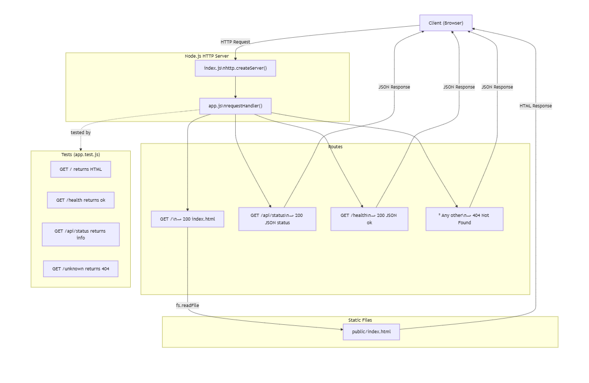

# azure-ci-cd

A simple Node.js HTTP server with no external dependencies, built for CI/CD demonstration on Azure.

## Project Structure

```
src/
├── app.js          # Request handler and route logic
├── index.js        # HTTP server entry point
├── app.test.js     # Tests (Node.js built-in test runner)
└── public/
    └── index.html  # Served at GET /
```

## Getting Started

No dependencies to install. Requires Node.js 18+.

```bash
# Start the server
npm start

# Start with file watching (auto-restart on changes)
npm run dev

# Run tests
npm test
```

The server runs on `http://localhost:3000` by default.

## Configuration

| Environment Variable | Default       | Description              |
|----------------------|---------------|--------------------------|
| `PORT`               | `3000`        | Port the server listens on |
| `NODE_ENV`           | `development` | Runtime environment      |

## Endpoints

| Method | Path          | Response            | Description                        |
|--------|---------------|---------------------|------------------------------------|
| GET    | `/`           | `200 text/html`     | Serves `public/index.html`         |
| GET    | `/health`     | `200 application/json` | Health check — `{ status: 'ok' }` |
| GET    | `/api/status` | `200 application/json` | Returns status, environment, and timestamp |
| *      | `*`           | `404 application/json` | Not Found                       |

## Architecture



## Testing

Tests use the Node.js built-in `node:test` runner — no test framework required.

```bash
npm test
```

Test coverage:
- `GET /` returns `200` with HTML content
- `GET /health` returns `200` with `{ status: 'ok' }`
- `GET /api/status` returns `200` with `status`, `environment`, and `timestamp`
- `GET /unknown` returns `404` with `{ error: 'Not Found' }`
